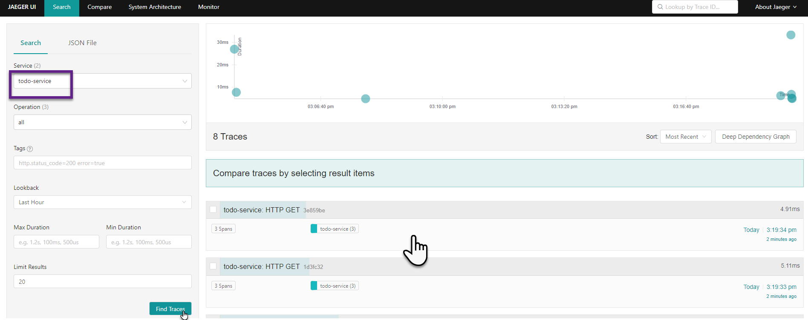
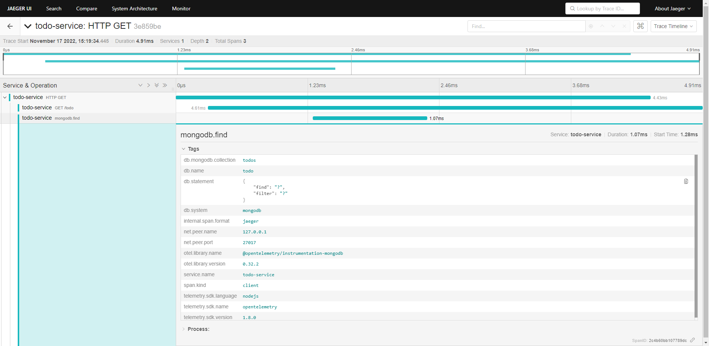

# OpenTelemetry - Instrumentation of a simple Node application

(based on this article: [How to Get Started with OpenTelemetry Node.js](https://www.aspecto.io/blog/getting-started-with-opentelemetry-node/)

The sources *app/index.js* and *app/tracing.js* are of interest. The latter provides the instrumentation for the former. Nothing was changed in the former - a simple Express based Node application that exposes a REST API and communicates with a Mongo Database - except for the addition of a require statement (for *tracing.js*). (note: instead of this require statement, we could also use a --require parameter when running the Node application)  

Run a Mongo Database with this statement:

```
docker run -d -p 27017:27017 mongo
``` 

Run the Jaeger trace collector and UI with this command:

```
docker run -d --name jaeger-stand-alone \
  -e COLLECTOR_ZIPKIN_HOST_PORT=:9411 \
  -p 5775:5775/udp \
  -p 6831:6831/udp \
  -p 6832:6832/udp \
  -p 5778:5778 \
  -p 16686:16686 \
  -p 14250:14250 \
  -p 14268:14268 \
  -p 14269:14269 \
  -p 9411:9411 \
  jaegertracing/all-in-one:1.39
```

In directory *app*, run the Node application - exposing an API on port 3000:

```
npm install
node .
```

Make a call (or a few) to the REST API using this curl command:

```
curl http://localhost:3000/todo
curl http://localhost:3000/todo/2
curl http://localhost:3000/todo/1
```

Now check in the Jaeger UI if you can find the traces (and of course you will be able to); open Jaeger UI at port 16686: 

  
Search for the traces for the *todo-service*.
  
Click on the of the traces to see more details - including the Mongo interaction:

  

## Introduce an Inspect a random Delay

Uncomment the line 

```
  // if (Math.random() < 0.3)  { await sleep(1000)  }   
```
in index.js. Restart the application.

Make a few calls to the REST API; some are likely to be slow:

```
curl http://localhost:3000/todo/2
curl http://localhost:3000/todo/1
curl http://localhost:3000/todo/3
curl http://localhost:3000/todo/3
curl http://localhost:3000/todo/3
curl http://localhost:3000/todo/1
```

Check in the Jaeger UI if you can find evidence of these slow requests (that should not be too hard).
  

